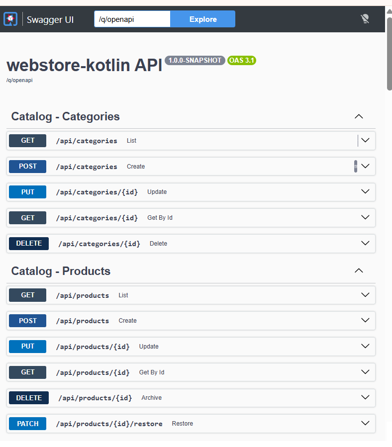

# Web Store API — Kotlin + Quarkus

REST API for an e-commerce web store (catalog, cart, checkout, orders, payments, inventory, coupons and customers), written in **Kotlin** on **Quarkus** and organised as a **Hexagonal Architecture (Ports & Adapters)**.

---

## Table of contents

1. [Architecture](#architecture)
2. [Project layout](#project-layout)
3. [Request flow example: checkout](#request-flow-example-checkout)
4. [Libraries & tech stack](#libraries--tech-stack)
5. [Good practices applied](#good-practices-applied)
6. [Running the application](#running-the-application)
7. [API overview](#api-overview)
8. [Configuration profiles](#configuration-profiles)
9. [Known gaps / next steps](#known-gaps--next-steps)

---

## Architecture

The code follows **Hexagonal Architecture** (a.k.a. Ports & Adapters / Clean Architecture). The business core (`domain` + `application`) knows nothing about HTTP, JSON, JPA or Stripe. Everything that talks to the outside world lives in `infrastructure` and plugs into the core through interfaces (**ports**).

```
                         ┌───────────────────────────────────────────┐
   HTTP clients          │           INFRASTRUCTURE (adapters)        │
  (web, mobile,  ──────► │                                           │
   admin, Swagger)       │  rest/*Resource  ── JAX-RS endpoints       │
                         │  rest/*Dtos      ── request/response DTOs  │
   Payment gateway ────► │  rest/*Mappers   ── DTO ⇄ domain (MapStruct)│
   webhooks              │  config/         ── Jackson, OpenAPI,      │
                         │                     GlobalExceptionMapper  │
                         └───────────────────┬───────────────────────┘
                                             │ calls (driving side)
                                             ▼
                         ┌───────────────────────────────────────────┐
                         │               APPLICATION                  │
                         │                                           │
                         │  port/in   ── use-case interfaces          │
                         │              (CheckoutPort, CartPort, …)   │
                         │  service   ── use-case implementations     │
                         │              (*PortImpl, @Transactional)   │
                         │  port/out  ── what the core NEEDS          │
                         │              (repositories, gateways)      │
                         └──────────┬─────────────────────┬──────────┘
                                    │ uses                │ declares
                                    ▼                     ▼
                  ┌─────────────────────────────┐   ┌──────────────────────┐
                  │           DOMAIN            │   │  port/out interfaces │
                  │                             │   │  implemented by  ▼   │
                  │  model/   ── entities &     │   └──────────┬───────────┘
                  │     value objects (Money,   │              │ (driven side)
                  │     Order, Cart, Product…)  │              ▼
                  │  service/ ── pure domain    │   ┌───────────────────────────────┐
                  │     logic (OrderTotal-      │   │   INFRASTRUCTURE (adapters)   │
                  │     Calculator)             │   │                               │
                  │  event/   ── domain events  │   │ persistence/adapter ─ *Impl   │
                  │                             │   │ persistence/entity  ─ JPA     │
                  │  NO framework dependencies  │   │ persistence/repository─Panache│
                  └─────────────────────────────┘   │ gateway/stripe ─ Payment GW   │
                                                    └───────────────┬───────────────┘
                                                                    │
                                                    ┌───────────────▼───────────────┐
                                                    │ PostgreSQL / H2  │  Stripe API │
                                                    └───────────────────────────────┘
```

## REST API endpoints



---
### Dependency rule

```
infrastructure  ──►  application  ──►  domain
      │                                  ▲
      └──────────────────────────────────┘
```

Dependencies only point **inwards**. The domain depends on nothing; the application layer depends only on the domain; infrastructure depends on both and implements the outbound ports. This means you can swap PostgreSQL for another store, or Stripe for PayPal, by writing a new adapter — without touching business code.

### Layers at a glance

| Layer | Package | Responsibility | May depend on |
|---|---|---|---|
| **Domain** | `domain.model`, `domain.service`, `domain.event` | Business entities, value objects, invariants, state machines, pure calculations | Kotlin stdlib only |
| **Application** | `application.port.in`, `application.service`, `application.port.out` | Use cases, orchestration, transactions, outbound port contracts | Domain, `shared` |
| **Infrastructure** | `infrastructure.rest`, `infrastructure.persistence`, `infrastructure.gateway`, `infrastructure.config` | HTTP, JSON, security, database, external services | Everything |
| **Shared** | `shared.exception` | Cross-cutting business exceptions | — |

---

## Project layout

```
src/main/kotlin/com/mycompany/webstore
├── domain
│   ├── model/            Product, Category, Cart, Order, Payment, Coupon,
│   │                     Customer, Address, Money, ShippingMethod, InventoryAuditLog
│   ├── service/          OrderTotalCalculator (pure function, no I/O)
│   └── event/            DomainEvents (sealed class: OrderPlaced, OrderPaid, StockReduced, …)
│
├── application
│   ├── port/in/          CartPort, CheckoutPort, OrderPort, PaymentPort, ProductPort, …
│   ├── port/out/         ProductRepository, OrderRepository, PaymentGatewayPort, …
│   └── service/          *PortImpl — use-case implementations
│
├── infrastructure
│   ├── rest/             JAX-RS resources grouped by feature
│   │   ├── catalog/      ProductResource, CategoryResource, DTOs, MapStruct mappers
│   │   ├── cart/         CartResource (anonymous session cookie or JWT user)
│   │   ├── checkout/     CheckoutResource
│   │   ├── orders/       OrderResource, AdminOrderResource
│   │   ├── payments/     PaymentResource, webhook endpoints
│   │   ├── customers/    registration + admin customer management
│   │   ├── inventory/    stock levels, adjustments, audit trail
│   │   └── admin/        CouponResource
│   ├── persistence
│   │   ├── entity/       *JpaEntity (Hibernate/JPA mapping only)
│   │   ├── repository/   Panache repositories
│   │   └── adapter/      *PersistenceAdapterImpl (implement port/out) + MapStruct mappers
│   ├── gateway/stripe/   StripeGatewayAdapter (implements PaymentGatewayPort)
│   └── config/           JacksonConfig, OpenApiConfig, GlobalExceptionMapper
│
└── shared/exception/     ResourceNotFound, BusinessRule, InsufficientStock, …

src/main/resources
├── application.properties        profile-based config (dev / test / prod)
└── db/migration/V1__init_schema.sql   Flyway schema
```

---

## Request flow example: checkout

`POST /api/orders` — turning a cart into an order:

```
Client
  │  POST /api/orders  { cartId, shippingAddress, shippingMethodId, couponCode }
  ▼
CheckoutResource            (infrastructure.rest)
  │  • @RolesAllowed("user","admin"), @Valid request body
  │  • customerId taken from JWT subject
  │  • DTO → domain Address
  ▼
CheckoutPort.placeOrder()   (application.port.in)
  ▼
CheckoutPortImpl            (application.service, @Transactional)
  │  1. load Cart           ── CartRepository            (port/out)
  │  2. load ShippingMethod ── ShippingMethodRepository  (port/out)
  │  3. check stock         ── ProductRepository         (port/out)
  │        └─ conflicts → InsufficientStockException → 409
  │  4. OrderTotalCalculator.calculate(items, coupon, shipping)   (domain)
  │  5. save Order (PENDING)            ── OrderRepository
  │  6. deduct stock + audit log        ── ProductRepository / InventoryAuditRepository
  │  7. increment coupon usage          ── CouponRepository
  │  8. clear cart                      ── CartRepository
  ▼
*PersistenceAdapterImpl     (infrastructure.persistence.adapter)
  │  domain ⇄ JPA entity via MapStruct, Panache for queries
  ▼
PostgreSQL / H2
```

The whole use case runs in a single transaction: if any step fails, nothing is committed.

---

## Libraries & tech stack

| Area | Library | Why |
|---|---|---|
| Language | **Kotlin 2.4** (JVM toolchain **21**) | Null-safety, data classes, concise immutable models |
| Framework | **Quarkus 3.38** (`quarkus-kotlin`, `quarkus-arc`) | Fast startup, low memory, CDI, live-reload dev mode |
| REST | `quarkus-rest-jackson` (JAX-RS / RESTEasy Reactive) | Declarative endpoints |
| JSON | `quarkus-jackson` + `jackson-module-kotlin` | Deserialising Kotlin data classes (see `JacksonConfig`) |
| Persistence | `quarkus-hibernate-orm-panache-kotlin` | Hibernate ORM with a Kotlin-friendly repository API |
| DB migrations | `quarkus-flyway` | Versioned, reproducible schema (`db/migration`) |
| Databases | `quarkus-jdbc-postgresql` (prod), `quarkus-jdbc-h2` (dev/test) | Real DB in prod, zero-setup in-memory DB locally |
| Validation | `quarkus-hibernate-validator` | Bean Validation (`@Valid`, `@NotBlank`, …) on DTOs |
| Mapping | **MapStruct 1.6** via `kapt` (CDI component model) | Compile-time, reflection-free DTO/entity ⇄ domain mapping |
| Security | `quarkus-smallrye-jwt`, `quarkus-smallrye-jwt-build` | JWT bearer auth, `@RolesAllowed` |
| Passwords | `org.mindrot:jbcrypt` | BCrypt password hashing |
| API docs | `quarkus-smallrye-openapi` | OpenAPI spec + Swagger UI |
| Testing | `quarkus-junit5`, REST Assured (Kotlin ext), `quarkus-test-security-jwt`, Testcontainers PostgreSQL, `mockito-kotlin` | Integration & unit tests |
| Build | Gradle (Kotlin DSL) + `io.quarkus` plugin, `kotlin("plugin.allopen")`, `kotlin("kapt")` | |

> **Kotlin + Quarkus note:** Kotlin classes are `final` by default, but CDI and Hibernate need to proxy them. The `allOpen` plugin in `build.gradle.kts` opens classes annotated with `@ApplicationScoped`, `@RequestScoped`, `@Path`, `@Entity`, `@MappedSuperclass` and `@QuarkusTest`.

---

## Good practices applied

### Architecture & design
- **Hexagonal architecture / dependency inversion** — the core defines interfaces (`port/out`), infrastructure implements them. Business code never imports JPA, JAX-RS or Stripe types.
- **Separate models per layer** — REST DTOs (`*Request`/`*Response`), domain models and `*JpaEntity` are distinct classes. API contracts, business rules and DB schema can evolve independently.
- **Use cases behind interfaces** (`port/in`) — resources depend on `CheckoutPort`, not on `CheckoutPortImpl`, which keeps controllers thin and use cases easy to mock.
- **Feature-oriented REST packages** — `catalog`, `cart`, `checkout`, `orders`, … instead of one huge `controllers` package.

### Domain modelling
- **Immutable domain models** — Kotlin `data class`es with `val`s; state changes use `copy(...)`.
- **Value objects with invariants** — `Money` enforces non-negative amounts, ISO-4217 currency and same-currency arithmetic through operator overloading (`+`, `-`, `*`).
- **Explicit state machine** — `Order.VALID_TRANSITIONS` + `canTransitionTo()` prevents illegal status changes (e.g. `DELIVERED → PENDING`).
- **Pure domain services** — `OrderTotalCalculator` is a side-effect-free `object`, trivial to unit-test.
- **Domain events** as a `sealed class` hierarchy (`OrderPlaced`, `StockReduced`, `PaymentFailed`, …), ready for event-driven integration.
- **Money as `BigDecimal`** — never `Double` for currency.

### Persistence & data integrity
- **Transactional use cases** — `@Transactional` on application services, so a checkout is all-or-nothing.
- **Optimistic locking** — `@Version` on `ProductJpaEntity` protects stock from concurrent overwrites.
- **Inventory audit trail** — every stock change writes an `InventoryAuditLog` entry (who, why, delta, order).
- **Versioned migrations** with Flyway and `hibernate-orm.database.generation=validate` in production — Hibernate never mutates the prod schema.
- **Soft delete / archive** for products (`DELETE` archives, `PATCH /restore` restores).
- **UUID primary keys** — safe to generate client- or service-side, not guessable.

### API & error handling
- **Centralised error handling** — `GlobalExceptionMapper` maps business exceptions to consistent JSON (`status`, `message`, `timestamp`):

  | Exception | HTTP |
  |---|---|
  | `ResourceNotFoundException` | 404 |
  | `DuplicateResourceException`, `InsufficientStockException` | 409 |
  | `BusinessRuleException`, `InvalidStatusTransitionException` | 422 |
  | `ConstraintViolationException` | 400 |
  | anything else | 500 (no internal details leaked) |

- **Input validation at the edge** — `@Valid` on request bodies.
- **Proper REST semantics** — `201 Created` + `Location` header on creation, `204 No Content` on deletes, `PATCH` for partial state changes.
- **Self-documenting API** — OpenAPI annotations (`@Tag`) and Swagger UI.
- **Non-null JSON output** — `quarkus.jackson.serialization-inclusion=non-null`.

### Security
- **JWT bearer authentication** with role-based authorisation (`@RolesAllowed("user"|"admin")`, `@PermitAll` for public endpoints).
- **Customer identity from the token** (`jwt.subject`), never from the request body.
- **Separate admin namespace** — `/api/admin/**`.
- **BCrypt** password hashing.
- **Security bypass scoped to `%dev` only** — production keys/issuer are under `%prod`.
- **Idempotency key** on payment initiation (`PaymentGatewayPort.initiatePayment`) and webhook signature verification contract (`parseWebhookEvent(payload, signature)`).

### Build & configuration
- **Profile-based config** (`%dev`, `%test`, `%prod`) in a single `application.properties`.
- **Compile-time mapping** (MapStruct/kapt) instead of runtime reflection.
- **Pinned toolchain** (`jvmToolchain(21)`) for reproducible builds.

---

## Running the application

### Prerequisites
- JDK 21
- Gradle 9.x (no wrapper script is committed — use a local `gradle` install)
- PostgreSQL (production profile only)

### Dev mode (H2 in-memory, live reload, security disabled)

```bash
gradle quarkusDev
```

### Run tests

```bash
gradle test
```

### Production build

```bash
gradle quarkusBuild
```

```bash
java -jar build/quarkus-app/quarkus-run.jar
```

Production requires PostgreSQL at `jdbc:postgresql://localhost:5432/webstore` and the JWT public key at `src/main/resources/META-INF/resources/publicKey.pem`.

### Useful URLs (port **8081**)

| What | URL |
|---|---|
| API base | http://localhost:8081/api |
| Swagger UI | http://localhost:8081/q/swagger-ui |
| OpenAPI spec | http://localhost:8081/q/openapi |

---

## API overview

| Area | Base path | Access |
|---|---|---|
| Products | `/api/products` | GET public · POST/PUT/DELETE/PATCH `admin` |
| Categories | `/api/categories` | GET public · write `admin` |
| Cart | `/api/cart` | public (session cookie `sessionId` or JWT) |
| Checkout | `POST /api/orders` | `user`, `admin` |
| Orders (customer) | `/api/orders` | `user`, `admin` |
| Orders (admin) | `/api/admin/orders` | `admin` — list, advance status, cancel |
| Payments | `/api/payments` | `user`, `admin` |
| Payment webhooks | `/api/payments/webhook/{stripe,paypal,mercadopago}` | public (signature-verified) |
| Customers | `POST /api/customers/register` | public |
| Customers (admin) | `/api/admin/customers` | `admin` — list, deactivate, reactivate |
| Inventory | `/api/admin/inventory` | `admin` — stock levels, adjustments, audit log |
| Coupons | `/api/admin/coupons` | `admin` — CRUD, activate/deactivate |

See Swagger UI for full request/response schemas.

---

## Configuration profiles

| Profile | Database | Schema management | Security |
|---|---|---|---|
| `dev` | H2 in-memory | Hibernate `drop-and-create`, Flyway disabled | Disabled (permit-all) |
| `test` | H2 in-memory | Hibernate `drop-and-create`, Flyway disabled | Dummy JWKS |
| `prod` | PostgreSQL | Flyway migrations + Hibernate `validate` | JWT verified with RSA public key |

> ⚠️ Never enable the `%dev` security bypass (`quarkus.security.auth.enabled-in-dev-mode=false`, permit-all policy) in production.

---

## Known gaps / next steps

- `StripeGatewayAdapter` is a **stub** — replace with real Stripe SDK calls and webhook signature verification.
- Domain events are defined but not yet published (e.g. via CDI events or an outbox).
- Test suite is a smoke test (`WebstoreApplicationTest`); add unit tests for domain logic (`Money`, `Order` transitions, `OrderTotalCalculator`) and use-case tests with mocked ports.
- `/q/health` is exercised by tests, but `quarkus-smallrye-health` is not yet a dependency.
- Externalise production secrets (DB credentials, JWT issuer) via environment variables.
